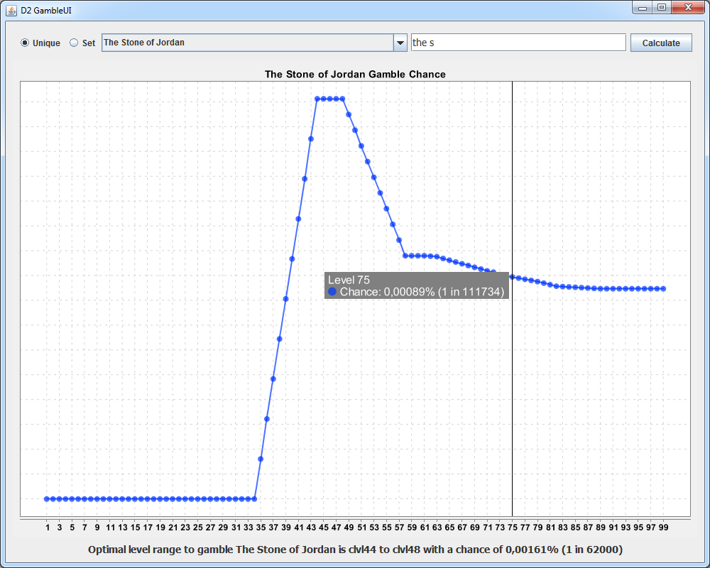

# D2GambleCalculator

Calculates and plots the chances to gamble a specific unique or set item in D2(R).

**Requires Java 8**

## Usage

Get the jar-file [here.](https://github.com/Karyoplasma/D2GambleCalculator/releases/latest) Double click to run.

The following files must be in the resources/ folder:
+ Armor.txt
+ Weapons.txt
+ Gamble.txt
+ SetItems.txt
+ UniqueItems.txt

**The names are case-sensitive.**

## Preview

## Dependencies

[XChart](https://github.com/knowm/XChart/blob/master/README.md) - licensed under [Apache License 2.0](https://github.com/knowm/XChart/blob/master/LICENSE)

[miglayout](https://github.com/mikaelgrev/miglayout/blob/master/README.md)

## License

[GNU GPL 3.0](LICENSE)